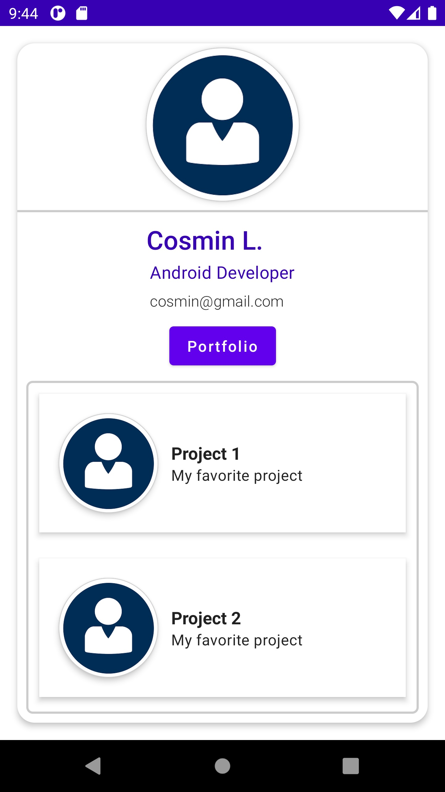

# business-card-compose-android
Business card app using Jetpack Compose (learning project)

## Overview
This code defines a Composable function named CreateBusinessCard that creates a business card UI component. When the user clicks on the "Portfolio" button, it shows a Content Composable function that displays a list of projects.

The CreateBusinessCard Composable function uses the Surface and Card components from Jetpack Compose to create a card-like UI element. The card's size is set to 200dp width and 390dp height, with a padding of 16dp.

The Column component is used to organize the UI elements vertically, including CreateImageProfile, CreateDivider, CreateInfoSection, and a Button component labeled "Portfolio".

When the "Portfolio" button is clicked, it toggles the buttonClickedState value from false to true or vice versa, displaying or hiding the Content Composable function that contains a list of projects.

The Content Composable function uses the Box and Surface components to create a container with a border that contains a list of projects created with the Portfolio Composable function.

The Portfolio Composable function uses the LazyColumn component to display a list of projects. Each project is shown in a Card component with an image and some text.

## Usage
To use this code, you can copy the functions into your Jetpack Compose project and call the CreateBusinessCard function from within your UI.

Note that this code assumes that you have already defined the CreateImageProfile, CreateDivider, and CreateInfoSection Composable functions. If you have not defined these functions, you will need to create them or modify the code to use different UI elements.

## Dependencies
This code depends on the Jetpack Compose library, which provides the @Composable annotation and the UI components used in the code.

## App

